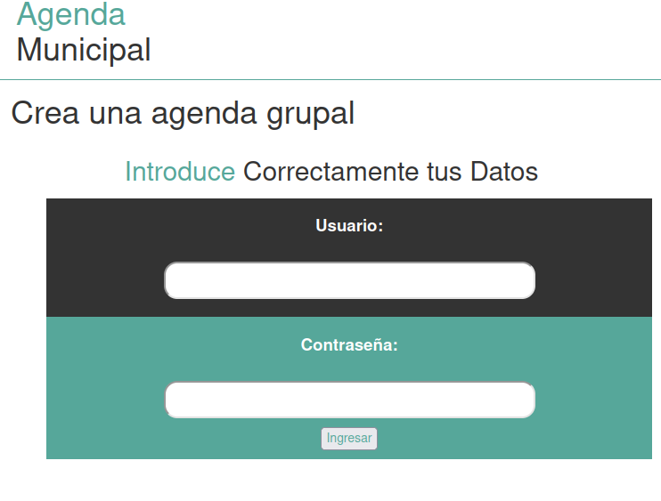
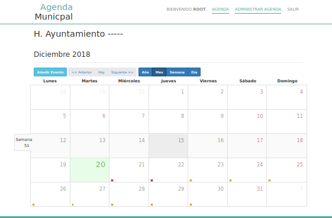
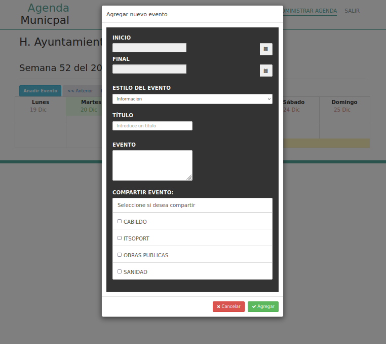
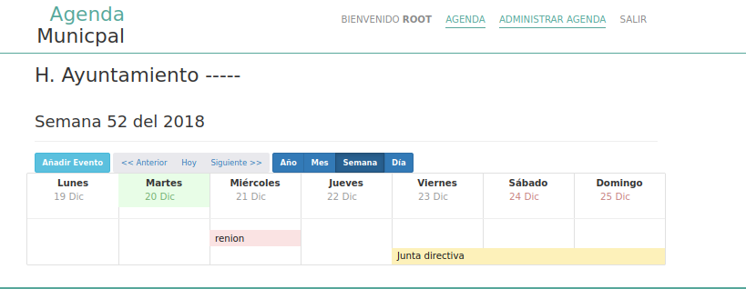

<h1 aling = "center">Agenda</h1>

Agenda web desarrollado en php7, mysql, bootstrap, jquery.

<figure>

    <figcaption>Login</figcaption>
</figure>

<figure>
    
     <figcaption>Calendario</figcaption>
</figure>

<figure>
    
</figure>
<figure>
    
</figure>
